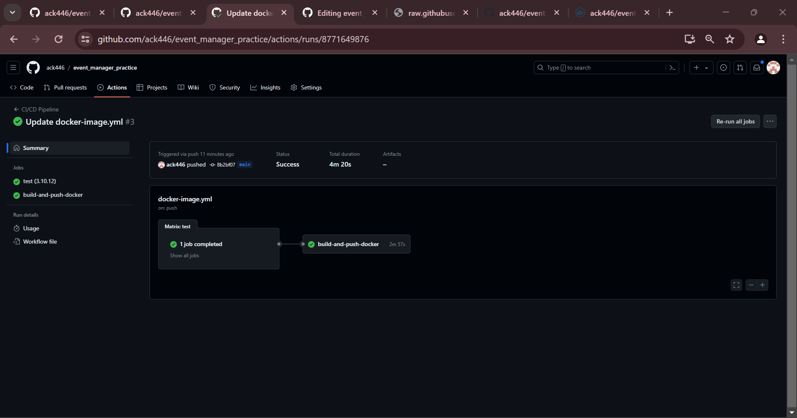
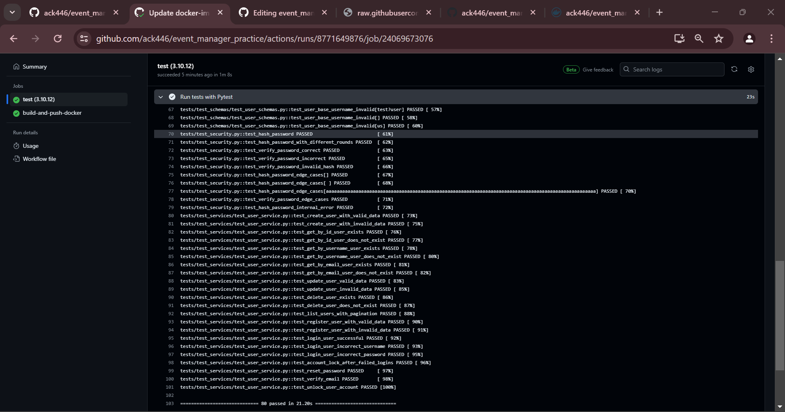
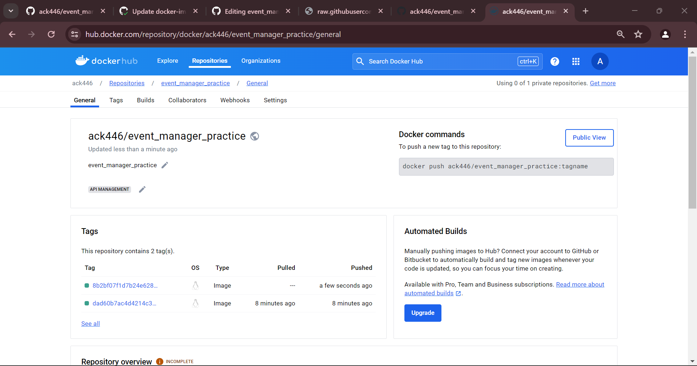

# Event Manager Company: Software QA Analyst/Developer Onboarding Assignment - Homework10

Welcome to the Event Manager Company! As a newly hired Software QA Analyst/Developer and a graduate student in software engineering, you are embarking on an exciting journey to contribute to our project aimed at developing a secure, robust REST API that supports JWT token-based OAuth2 authentication. This API serves as the backbone of our user management system and will eventually expand to include features for event management and registration.

## Screenshots

1.  Screenshot of the image in CI/CD Pipeline here.

CI/CD Pipeline : [https://github.com/ack446/event_manager_practice/deployments/productionn](https://github.com/ack446/event_manager_practice/deployments/production)

2.  Screenshot of the Test Cases.

Test Casee : [https://github.com/ack446/event_manager_practice/deployments/productionn](https://github.com/ack446/event_manager_practice/deployments/production)

3.  Screenshot of the image in Docker account here.

Docker Hub : [https://hub.docker.com/repository/docker/ack446/event_manager_practice/general](https://hub.docker.com/repository/docker/ack446/event_manager_practice/general)

## Issues 
- Internal server issue
- Username validation
- Password validation
- Profile field edge cases 

## Reflection
Undertaking this assignment was both challenging and rewarding. I gained practical experience in software version control. This allowed for effective tracking of changes and ensured code quality before merging into the main branch. Additionally, deepening my understanding of RESTful API integration was invaluable for seamless communication between services. Implementing automated CI/CD pipelines, with successful builds triggering unit tests and deployment to DockerHub, streamlined deployment processes significantly. However, the most significant learning came from troubleshooting and debugging issues encountered during the assignment.

In particular, I learned the importance of thorough logging within applications. When faced with errors, analyzing logs helped identify the root cause and guided the debugging process effectively. Furthermore, paying close attention to the status of the back-end database proved crucial. This awareness prevented misattributing application issues to database problems and vice versa. Collaboratively, adhering to Git workflow and best practices ensured smooth collaboration and version control within the team. Overall, this assignment not only enhanced my technical skills but also underscored the importance of meticulous documentation and collaborative processes in software development.
